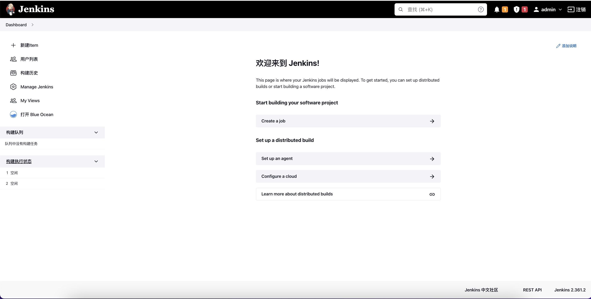
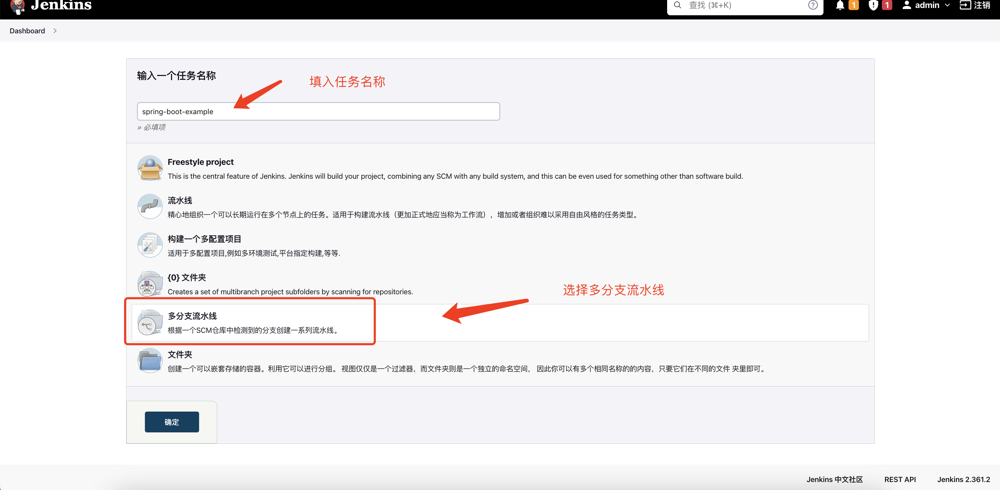
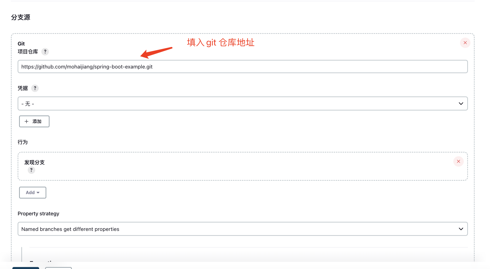
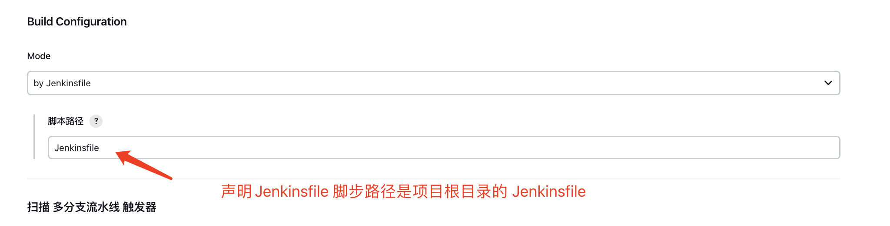
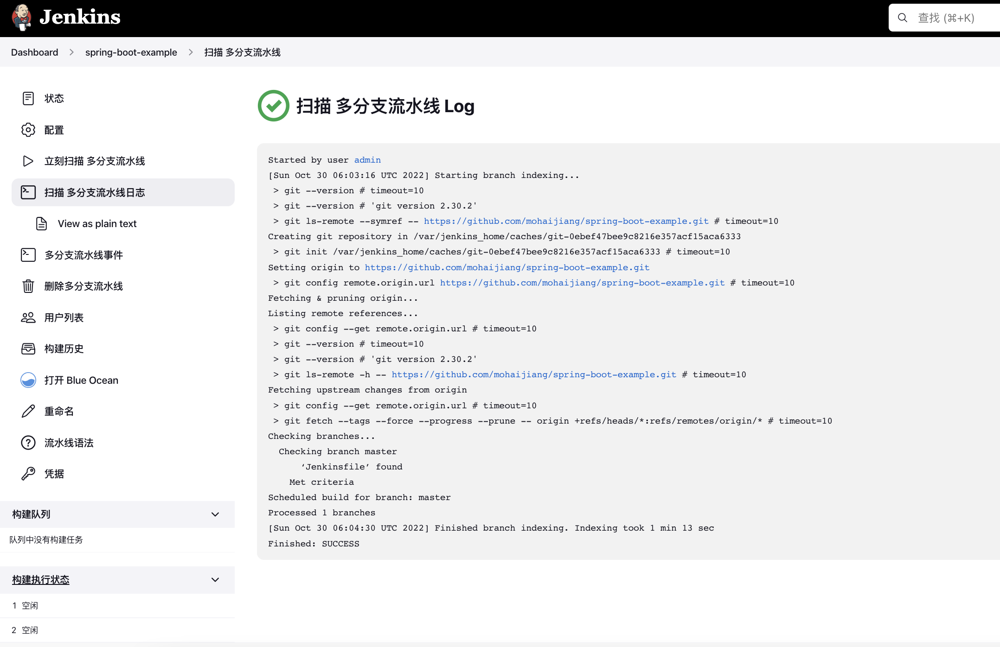
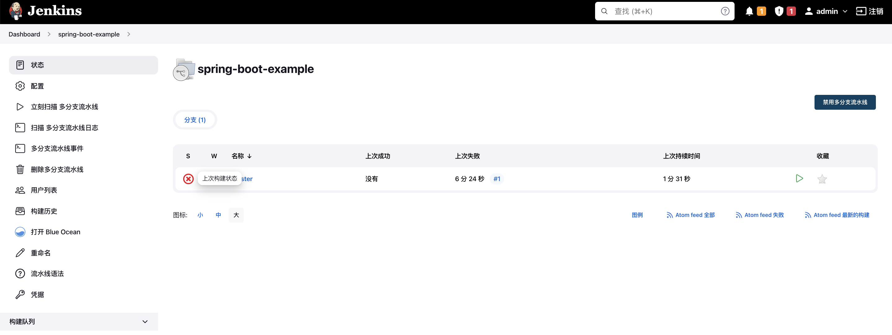
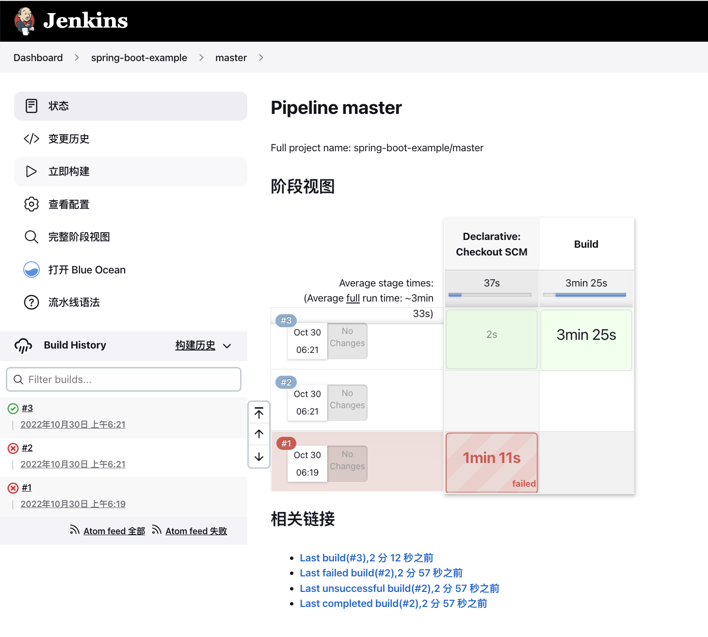
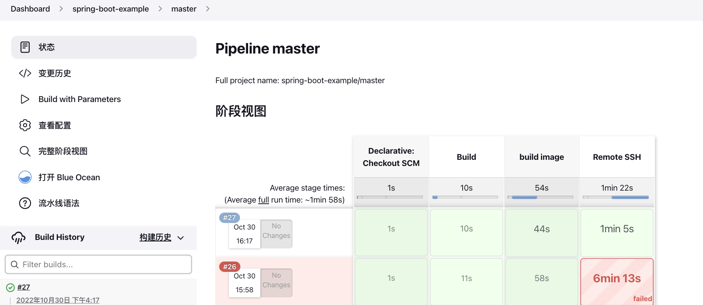
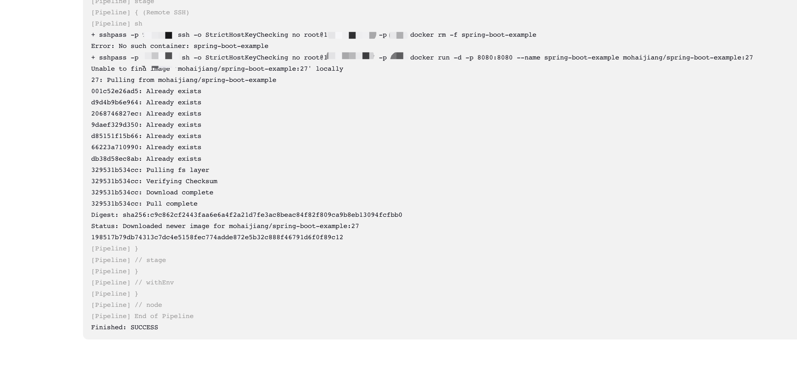

# jenkins pipeline 介绍

本文旨在向各位读者介绍jenkins pipeline 流水线的典型用法，欢迎各位读者留言，共同学习。

当前免费或开源的cicd工具一直是当前软件开发过程中，不可缺少的一部分。

其中，我推荐三种工具，分别是github action, gitlab ci 和 jenkins pipeline.

这3种工具拥有共同的特点：使用dsl语法声明文件，将交付过程"作为代码" 进行建模。

今天我们先来说jenkins pipeline.

对Jenkins 流水线的定义被写在一个文本文件中 (成为 Jenkinsfile)，该文件可以被提交到项目的源代码的控制仓库。 这是"流水线即代码"的基础; 将CD 流水线作为应用程序的一部分，像其他代码一样进行版本化和审查。 创建 `Jenkinsfile`并提交它到源代码控制中提供了一些即时的好处:

* 自动地为所有分支创建流水线构建过程并拉取请求。

* 在流水线上代码复查/迭代 (以及剩余的源代码)。

* 对流水线进行审计跟踪。

* 该流水线的真正的源代码, 可以被项目的多个成员查看和编辑。


本文不想太过详细的说明这个pipeline 的语法，具体语法可以到 [https://www.jenkins.io/zh/doc/book/pipeline/ ](https://www.jenkins.io/zh/doc/book/pipeline/) 官网进行查看。

备注： 本文大量的采用了[docker](https://docs.docker.com/get-started/)技术进行构建与部署，还未掌握的同学可以先去了解一下.


## 设计场景

我们采用一个典型场景， 代码更新+代码构建+ 镜像 + 部署


### 构建

首先介绍pipeline 文件

```
pipeline {
    agent {
        docker {
            image 'maven:3.8.1-adoptopenjdk-11'
            args '-v /root/.m2:/root/.m2'
        }
    }
    stages {
        stage('Build') {
            steps {
                sh 'mvn -B -DskipTests clean package'
            }
        }
    }
}

```

解释以上pipeline 文件前，我首先介绍几个概念

* Stage: 阶段，一个Pipeline可以划分为若干个Stage，每个Stage代表一组操作。注意，Stage是一个逻辑分组的概念，可以跨多个Node。
* Step: 步骤，Step是最基本的操作单元，小到创建一个目录，大到构建一个Docker镜像，由各类Jenkins Plugin提供。
* agent： 代理节点，指的是在运行响应脚步的具体环境，常见环境有： any、docker等


了解这些概念后，以上的pipeline就非常容易看懂

1. 声明全局的pipeline的执行环境是一个容器环境，具体容器镜像为`maven:3.8.1-adoptopenjdk-11`,并为这个容器挂载一个数据卷，从宿主机的`/root/.m2`映射到容器内的`/root/.m2`
2. 声明一个`Build`阶段，在这个阶段内执行一个step 步骤， 具体执行的命令是`mvn -B -DskipTests clean package`

Ok， 以上pipeline就完成了一个java代码的构建。

让我们实际看一下效果。


登录本地安装的jenkins http://localhost:8080， （安装方式在项目的Doc目录中）

首先登录后



我们选择创建`Create a job`,创建一个job，选择多分支流水线,



在job详情页，输入仓库地址。 本文仓库为`https://github.com/mohaijiang/spring-boot-example.git`



注意配置Jenkinsfile 在仓库中的位置。如果Jenkinsfile文件名变动或位置变动，此处需要相应变动。



最后保存。

保存后，仓库会自动触发一个分支索引。



完成后如图



让我们点击运行吧。运行效果如图



### 完整流程

有了以上例子，下面我们来看一个构建+部署的完整流程

```shell
pipeline {

    agent any
    parameters {
        string(defaultValue: "",description: 'remote host password', name: 'sshPassword')
    }

    stages {

        stage('Build') {
            agent {
                docker {
                    image 'maven:3.8.1-adoptopenjdk-11'
                    args '-v /root/.m2:/root/.m2'
                    reuseNode true
                }
            }
            steps {
                sh 'mvn -B -DskipTests clean package'
            }
        }

        stage('build image'){

            steps {

                 script {
                         docker.withRegistry( '', 'my-docker-credentials' ) {
                             dockerImage = docker.build 'mohaijiang/spring-boot-example'
                             dockerImage.push("$BUILD_NUMBER")
                             dockerImage.push('latest')
                          }
                        }
            }
        }

        stage('Remote SSH') {
            steps {


               sh """
                sshpass -p ${params.sshPassword} ssh -o "StrictHostKeyChecking no"   root@183.66.65.207 -p 2209 docker rm -f spring-boot-example
                sshpass -p ${params.sshPassword} ssh -o "StrictHostKeyChecking no"   root@183.66.65.207 -p 2209 docker run -d -p 8080:8080 --name spring-boot-example mohaijiang/spring-boot-example:$BUILD_NUMBER
               """
            }
        }

    }
}

```


以上Jenkinsfile 包括三个步骤，分别是编译，构建java镜像，以及远程登录ssh并运行镜像

我们分别看是如何实现的。

* 构建镜像
```shell
    stage('build image'){

            steps {

                 script {
                         docker.withRegistry( 'docker.io', 'my-docker-credentials' ) {
                             dockerImage = docker.build 'mohaijiang/spring-boot-example'
                             dockerImage.push("$BUILD_NUMBER")
                             dockerImage.push('latest')
                          }
                        }
            }
        }
```

此处使用了 jenkins 的 script 定义。 script 定义域内，运行执行一些 非dsl的jenkins语法。此处使用docker语法来进行镜像的构建与推送。

docker.withRegistry 接收2个参数，

其一是推送的镜像的仓库。本案例使用docker.io官方仓库。 如果各位同学有其他私有仓库，可以替换。

其二是第一个参数仓库的对应的账号密码。 jenkins 采用 `credentials` 来管理dsl中使用的账号密码。 配置过jenkins原生svn或git 拉取代码的小伙伴应该很熟悉这个机制。

`dockerImage = docker.build 'mohaijiang/spring-boot-example' ` 指的是利用项目根目录的`Dockerfile` 文件构建镜像
`dockerImage.push("$BUILD_NUMBER")` 与 `dockerImage.push('latest')` 指的是将镜像打上tag，并推送到镜像仓库之中。

这样，镜像构建就完成了。

```shell
        stage('Remote SSH') {
            steps {


               sh """
                sshpass -p ${params.sshPassword} ssh -o "StrictHostKeyChecking no"   root@183.66.65.207 -p 2209 docker rm -f spring-boot-example
                sshpass -p ${params.sshPassword} ssh -o "StrictHostKeyChecking no"   root@183.66.65.207 -p 2209 docker run -d -p 8080:8080 --name spring-boot-example mohaijiang/spring-boot-example:$BUILD_NUMBER
               """
            }
        }
```

以上步骤定义了一个远程执行命令。 分别是杀死原来已经启动的容器，启动新的容器。

此处利用了`sshpaas` 向ssh命令传递密码参数,利用`ssh` 命令远程执行。 执行的具体命令是`docker rm -f spring-boot-example`（删除原有容器)和
`docker run -d -p 8080:8080 --name spring-boot-example mohaijiang/spring-boot-example:$BUILD_NUMBER` 启动一个新的容器。

至此，一个简单的构建和部署的典型流程就结束了。

让我们看一下执行结果：



具体的执行日志




有些同学可能会好奇，拉取代码这个步骤呢？ 其实使用代码嵌入的Jenkinsfile， 每次构建会自动的拉取代码，不用特意的进行声明。

## 一些实践中不一样的内容

在实际的项目中，以上步骤可能还需要加入更多的步骤。比如：

* 前后端分离项目，所以先构建后端，再构建前端，打成2个镜像，并一起发布

* 构建镜像前进行sonarqube 代码扫描和junit单元测试

* 实际部署不肯能使用`sshpass` 输入密码这么`简单粗暴`，使用公私钥对来避免密码输入

* 部署不使用 `docker run` ，容器环境使用 `docker compose` 或 kubernetes 的`kubectl` 或`helm` 来进行部署。
  非容器环境使用`s3cmd`从制品库拉下构建物
  
* 加快部署效率，使用并行流程

## 总结

jenkins pipeline正在做到了自由的定义流程，不受限与表单，尤其是嵌入代码的Jenkinsfile
允许各位小伙伴想写代码一样的定义构建流程，并可以很方便的被他人审计。本文就抛个砖头，希望对
大家有所帮助。


以后有机会继续 CICD的第二弹 `gitlab ci` ， 和第三弹 `github Action`，它们各自拥有与jenkins不一样的特点。

所有的完整代码在github开源，欢迎fork。 地址：[https://github.com/mohaijiang/spring-boot-example](https://github.com/mohaijiang/spring-boot-example) 
